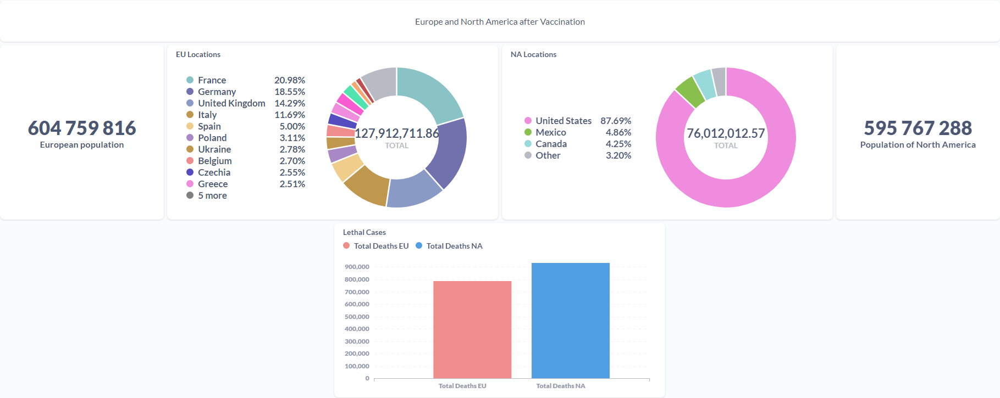

# NEW and LETHAL COVID Cases Correlation
## Goal of my project
* Comparison of new cases and lethal outcomes from COVID by regions for people after vaccination.
* To enhance my skills of __SQL__ Quarries and visualization tools usage(__METABASE__).
 
## Initialization
 
I started my project from finding a DB for it and I found an open statistic on [owid-data](https://github.com/owid/covid-19-data).
There was ```owid-covid-data.csv``` therefore I have to inject it to my DB.
I opened that file in text redactor. There was all names of the columns in first string, which I parsed. Then I checked which type of DATA we had in our DB. As the result I noticed that there were  ```FLOAT``` mostly, but some columns had ```VARCHAR``` and one had ```DATE```.
And after I made a Query for a Table creation with everything that was needed for importing DATA.
The following script I used to create the table ```Covid_19``` :
```sql
CREATE TABLE Covid_19 (
iso_code VARCHAR,
continent VARCHAR,
location VARCHAR,
`date` DATE,
total_cases FLOAT ,
new_cases FLOAT ,
new_cases_smoothed FLOAT,
total_deaths FLOAT,
new_deaths FLOAT,
new_deaths_smoothed FLOAT,
total_cases_per_million FLOAT,
new_cases_per_million FLOAT,
new_cases_smoothed_per_million FLOAT,
total_deaths_per_million FLOAT,
new_deaths_per_million FLOAT,
new_deaths_smoothed_per_million FLOAT,
reproduction_rate FLOAT,
icu_patients FLOAT,
icu_patients_per_million FLOAT,
hosp_patients FLOAT,
hosp_patients_per_million FLOAT,
weekly_icu_admissions FLOAT,
weekly_icu_admissions_per_million FLOAT,
weekly_hosp_admissions FLOAT,
weekly_hosp_admissions_per_million FLOAT,
total_tests FLOAT,
new_tests FLOAT,
total_tests_per_thousand FLOAT,
new_tests_per_thousand FLOAT,
new_tests_smoothed FLOAT,
new_tests_smoothed_per_thousand FLOAT,
positive_rate FLOAT,
tests_per_case FLOAT,
tests_units VARCHAR,
total_vaccinations FLOAT,
people_vaccinated FLOAT,
people_fully_vaccinated FLOAT,
total_boosters FLOAT,
new_vaccinations FLOAT,
new_vaccinations_smoothed FLOAT,
total_vaccinations_per_hundred FLOAT,
people_vaccinated_per_hundred FLOAT,
people_fully_vaccinated_per_hundred FLOAT,
total_boosters_per_hundred FLOAT,
new_vaccinations_smoothed_per_million FLOAT,
new_people_vaccinated_smoothed FLOAT,
new_people_vaccinated_smoothed_per_hundred FLOAT,
stringency_index FLOAT,
population FLOAT,
population_density FLOAT,
median_age FLOAT,
aged_65_older FLOAT,
aged_70_older FLOAT,
gdp_per_capita FLOAT,
extreme_poverty FLOAT,
cardiovasc_death_rate FLOAT,
diabetes_prevalence FLOAT,
female_smokers FLOAT,
male_smokers FLOAT,
handwashing_facilities FLOAT,
hospital_beds_per_thousand FLOAT,
life_expectancy FLOAT,
human_development_index FLOAT,
excess_mortality_cumulative_absolute FLOAT,
excess_mortality_cumulative FLOAT,
excess_mortality FLOAT,
excess_mortality_cumulative_per_million FLOAT);
```
 
After the DB table was created I imported DATA using __pgAdmin__ where I had a local server. There is an option when you can import DATA from ```.csv```.
Now I had a table filled with DATA which was provided by ```owid-covid-data.csv```.
Then I made __METABASE__ localhost and connected the DB with METABASE server.
## __Ukraine__ and Poland COVID comparison
For my project I decided to visualize how new cases of COVID correlate with Deaths in my country __Ukraine__ and neighbor __Poland__ for vaccinated people. Also I tried to detect when different COVID “waves” happened in these countries.
I chose DATA which I need to made Query:
```sql
SELECT new_cases_smoothed AS NEW_REGISTERED_CASES
    ,DATE
FROM covid_19
WHERE location = 'Ukraine'
    AND people_vaccinated IS NOT NULL;
```
And I created the diagram with received data:

 
Then I did the same for __Poland__.
I noticed that __Ukraine__ stopped receiving DATA since ```'2022-02-23'```.
To compare __Ukraine__ and __Poland__ I used date restriction in the following Query:
```sql
SELECT new_cases_smoothed AS NEW_REGISTERED_CASES
    ,DATE
FROM covid_19
WHERE location = 'Poland'
    AND people_vaccinated IS NOT NULL
    AND DATE BETWEEN '2020-01-01' AND '2022-02-23';
```
     
Also I created similar Query and diagrams for lethal cases:
```sql
SELECT new_deaths_smoothed
    ,DATE
FROM covid_19
WHERE location = 'Ukraine'
    AND people_vaccinated IS NOT NULL;
```

 
To make it more visible I displayed counts of "_new_" and "_lethal_" cases

Now you can see that __Ukraine__ has less total cases but more lethal outcome than __Poland__.
## Continents COVID comparison
I decided to compare _new_ and _lethal_ COVID cases for different continents for vaccinated people. Therefore I started looking for something similar based on the population of the continents.

These findings were found using the following:
```sql
SELECT continent
    ,SUM(DISTINCT population) AS Population
FROM covid_19
GROUP BY continent;
```


I noticed that Europe includes 'Russia' with 140 millions population and Russia is not real European part of continent so I decided to remove it from received DATA:
```sql
SELECT continent
    ,SUM(DISTINCT population) AS Population
FROM covid_19
WHERE NOT (location = 'Russia')
GROUP BY continent
```
As the result we have more closer and useful DATA for comparison:
* __Europe__ 604 mil
* __North America__ 595 mil
 
At that time I decided to use another type of diagram and choose what DATA I need.
The following Query was used to receive DATA for European continent:
```sql
SELECT sum(New_Cases_Smoothed) AS Cases
    ,location
FROM covid_19
WHERE continent = 'Europe'
    AND NOT (location IN 'Russia')
    AND people_vaccinated IS NOT NULL
GROUP BY location
ORDER BY Cases DESC
```
As you can see on the next diagram, the percentages of new cases are shown for different countries:

 
 
Then I counted lethal cases:


### Conclusion
Finally, we have the following diagram which shows _new_ and _lethal_ COVID cases for __Europe__ and __North America__:

 
Europe has less lethal cases than North America, while Europe has nearly twice as many new cases as North America.
In my opinion it might be due to higher quality of healthcare in Europe rather than in North America.
Take note, that all previous results were presented for vaccinated people.
