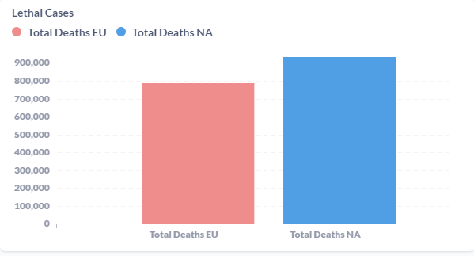

# COVID TEST PROJECT
I started my project from finding DB for it and I found open statistic on [owid-data](https://github.com/owid/covid-19-data), there was ```owid-covid-data.csv``` so I have to inject it to my DB.
I opened that file in text redactor and in first string was all names of columns, what I parsed and made Query for creating Table with everything needed for importing DATA.
```sql
CREATE TABLE Covid_19 (
iso_code VARCHAR,
continent VARCHAR,
location VARCHAR,
`date` DATE,
total_cases FLOAT ,
new_cases FLOAT ,
new_cases_smoothed FLOAT,
total_deaths FLOAT,
new_deaths FLOAT,
new_deaths_smoothed FLOAT,
total_cases_per_million FLOAT,
new_cases_per_million FLOAT,
new_cases_smoothed_per_million FLOAT,
total_deaths_per_million FLOAT,
new_deaths_per_million FLOAT,
new_deaths_smoothed_per_million FLOAT,
reproduction_rate FLOAT,
icu_patients FLOAT,
icu_patients_per_million FLOAT,
hosp_patients FLOAT,
hosp_patients_per_million FLOAT,
weekly_icu_admissions FLOAT,
weekly_icu_admissions_per_million FLOAT,
weekly_hosp_admissions FLOAT,
weekly_hosp_admissions_per_million FLOAT,
total_tests FLOAT,
new_tests FLOAT,
total_tests_per_thousand FLOAT,
new_tests_per_thousand FLOAT,
new_tests_smoothed FLOAT,
new_tests_smoothed_per_thousand FLOAT,
positive_rate FLOAT,
tests_per_case FLOAT,
tests_units VARCHAR,
total_vaccinations FLOAT,
people_vaccinated FLOAT,
people_fully_vaccinated FLOAT,
total_boosters FLOAT,
new_vaccinations FLOAT,
new_vaccinations_smoothed FLOAT,
total_vaccinations_per_hundred FLOAT,
people_vaccinated_per_hundred FLOAT,
people_fully_vaccinated_per_hundred FLOAT,
total_boosters_per_hundred FLOAT,
new_vaccinations_smoothed_per_million FLOAT,
new_people_vaccinated_smoothed FLOAT,
new_people_vaccinated_smoothed_per_hundred FLOAT,
stringency_index FLOAT,
population FLOAT,
population_density FLOAT,
median_age FLOAT,
aged_65_older FLOAT,
aged_70_older FLOAT,
gdp_per_capita FLOAT,
extreme_poverty FLOAT,
cardiovasc_death_rate FLOAT,
diabetes_prevalence FLOAT,
female_smokers FLOAT,
male_smokers FLOAT,
handwashing_facilities FLOAT,
hospital_beds_per_thousand FLOAT,
life_expectancy FLOAT,
human_development_index FLOAT,
excess_mortality_cumulative_absolute FLOAT,
excess_mortality_cumulative FLOAT,
excess_mortality FLOAT,
excess_mortality_cumulative_per_million FLOAT);
```

Before I checked what type of DATA in all column and I notice there mostly ```FLOAT``` but some columns had ```VARCHAR``` and one ```DATE```
After DB table was created I import DATA using __pgAdmin__ where I had local server. There is option when you can imprort DATA from ```.csv```
Now I had table filled with DATA what provide ```owid-covid-data.csv```
Then I made METABASE localhost and connect DB with METABASE.
For my projec I decide create visualisation how new caces of COVID correlate with Deaths in my country __Ukraine__ and neighbor __Poland__ and around what time was different "waves" of COVID.
I chose DATA what I need and made Query
```sql
SELECT new_cases_smoothed AS NEW_REGISTERED_CASES
	,DATE
FROM covid_19
WHERE location = 'Ukraine'
	AND people_vaccinated IS NOT NULL
``` 
and made diagram with received data


Then I did same to __Poland__ but for __Poland__ to make compare more precise I use DATE restriction because I noticed that __Ukraine__ stopped receive DATA since ```'2022-02-23'``` so I used Query
```sql 
SELECT new_cases_smoothed AS NEW_REGISTERED_CASES
	,DATE
FROM covid_19
WHERE location = 'Poland'
	AND people_vaccinated IS NOT NULL
	AND DATE BETWEEN '2020-01-01' AND '2022-02-23'
``` 
      
and similar diagrams with Lethal cases
```sql
SELECT new_deaths_smoothed
	,DATE
FROM covid_19
WHERE location = 'Ukraine'
	AND people_vaccinated IS NOT NULL
```


and to make it more visible I made count of "_new_" and "_lethal_" cases

Now you can see that __Ukraine__ has less total cases but more lethal outcome then __Poland__.
After this I decide make compare between continents so I start looking something simillar with population
```sql
SELECT continent
	,SUM(DISTINCT population) AS Population
FROM covid_19
GROUP BY continent
```

I notice that Europe include 'Russia' with 140 mil population and Russia is not real European part of continent so I decide remove it from received data
```sql
SELECT continent
	,SUM(DISTINCT population) AS Population
FROM covid_19
WHERE NOT (location = 'Russia')
GROUP BY continent
```
and now 
* __Europe__ 604 mil
* __North America__ 595 mil

what is more close and useful for comparing
This time I decide use another diagram and chose what DATA I need for that
```sql
SELECT sum(New_Cases_Smoothed) AS Cases
	,location
FROM covid_19
WHERE continent = 'Europe'
	AND NOT (location IN 'Russia')
	AND people_vaccinated IS NOT NULL
GROUP BY location
ORDER BY Cases DESC
```

You can see here the percentage of new cases in different countries and total cases as well.

Then I did count of lethal outcomes


Finaly we have this

Where we can make a conclusion:
Europe has less lethal outcome while nearly twice as many new cases as North America.

 